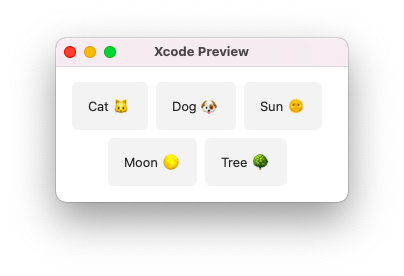

# SwiftUI WrappingStack

     [](https://github.com/diniska/swiftui-wrapping-stack/actions/workflows/test.yml) [](https://codebeat.co/projects/github-com-diniska-swiftui-wrapping-stack-void)

A SwiftUI Views for wrapping HStack elements into multiple lines.

## List of supported views

* `WrappingHStack` - provides `HStack` that supports line wrapping

## How to use
### Step 1
Add a dependency using Swift Package Manager to your project: [https://github.com/diniska/swiftui-wrapping-stack](https://github.com/diniska/swiftui-wrapping-stack)

### Step 2
Import the dependency

```swift
import WrappingStack
```

### Step 3
Replace `HStack` with `WrappingHStack` in your view structure. It is compatible with `ForEach`. 
 
```swift
struct MyView: View {

    let elements = ["Cat 🐱", "Dog 🐶", "Sun 🌞", "Moon 🌕", "Tree 🌳"]
    
    var body: some View {
        WrappingHStack(id: \.self) { // use the same id is in the `ForEach` below
            ForEach(elements, id: \.self) { element in
                Text(element)
                    .padding()
                    .background(Color.gray)
                    .cornerRadius(6)
            }
        }
        .frame(width: 300) // limiting the width for demo purpose. This line is not needed in real code
    }
    
}
```

The result of the code above:




## Customization

Customize appearance using the next parameters. All the default SwiftUI modifiers can be applied as well.

### `WrappingHStack` parameters

Parameter name | Description
---------------|--------------
`alignment`    | horizontal and vertical alignment. `.center` is used by default. Vertical alignment is applied to every row
`horizontalSpacing` | horizontal spacing between elements
`verticalSpacing` | vertical spacing between the lines

## Performance considerations

The code written in a way to cache the elements representing views sizes, it doesn't re-calculate the size for different views with the same id.

* huge numbers of elements are not recommended, although the same applies to `HStack` where `LazyHStack` is a better alternative for the long rows. If you have a large number of elements - double-check the memory and performance on a real device
* it is pretty good in terms of CPU consumption as every element calculates its size only once.
